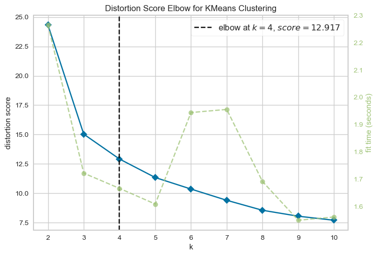
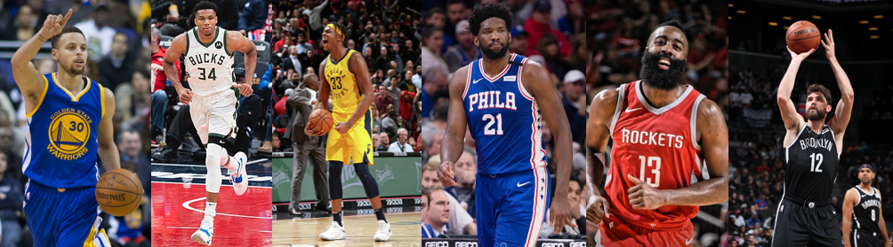

# Using Kmeans to find new NBA PlayerTypes
Inspired by a few Medium articles, in this repository we'll group NBA players using Kmeans algorithm to define offensive type of players and to suggest new signings.

In the world of professional basketball, particularly the NBA, players exhibit diverse playing styles and strengths offensively. This project aims to apply K-Means clustering to group NBA players based on their possession percentages in various play-types in 2019 & 2020 seasons. By doing so, we seek to uncover distinctive player profiles, enhance performance analysis in the NBA.
Additionally, we aim to propose potential player acquisitions to replace those with similar playing styles, contributing to strategic decision-making for teams.

## The data

In this project we use differents datasets. For the data of possesion percentatges in various play-types, we use 2 datasets, one for the 2018-2019 season and the other one for de 2019-2020 season. The 2019-2020 season dataset is in Kaggle and the 2018-2019 we find it in a Github repostiory mentioned in the end of this article. In total we have 583 players and 12 columns.

To analyse each new player-type and to suggets potential player acquisitions to teams, we use data extracted from Basketball Reference (https://www.basketball-reference.com/).

## Clustering
First of all, we read the data and clean it so that we can work comfortable. Our dataframe has 583 players with 11 variables. Apart from the name and the team of the players and the season, we have the frequency of each play-style. These play-styles are: 
- Isolation
- Pick & Roll Ball Handler
- Pick & Roll Roll Man
- Transition
- Post up
- Spot up
- Cut
- Handoff
  
Once we have the data cleaned, we can start to build our Kmeans model. 
We decide to use Kmeans but it's very important to choose wisely how many clusters to model. So our first step is to use the elbow method to find the optimal number of clusters in our data. Here is the result:

{width=50px height=25px}

Analysing the graph, we would declare that the optimal k is 4. However, we know nowadays there aren't only 4 types of offensive players, so we declare k=6.

Now, we fit the model with k=6 and add the new clusters to our data.

## Results

After reviewing how the model grouped our data, we can define the 6 different offensive player-type and see their characteristics in this HeatMap:

 {width=300px height=200px}

The first cluster we name it **Spot Up Wing**. As we can see, these players usually spot up behind the arc and create in transition. Also, we can see that they operate more as handler than as a roll-man in the pick&rolls. **All Ofensive** players are defined by a high number of possesions in different play-styles. They usually create in transition, spot up behind the arc, they are the handlers in the pick&rolls and sometimes they play in isolation. Another cluster is **Rim Runners**. These players have an specific offensive style. They are always cutting and generate buckets through setting screens and rolling to the basket. Then, we have the **Post Up Big** that as the name says, they usually post up and operate as roll-man in the pick&rolls. The **On-ball Handler** as we can observe in the heat map are very defined by being the handlers in the pick&rolls but also sometimes they occupy exterior position to shoot, create in transition and are isolated. Finally, **Spot Up Big** are these big players that post up but also they can spot up behind the arc and make transitions.

Here is a list of 5 different players that are in each offensive type of players:

- All Ofensive: Stephen Curry, Paul George, Kevin Durant, Bradley Beal, Khris Middleton
- Spot Up Wing: Giannis Antetokounmpo, Julius Randle, Danilo Gallinari, Kevin Love, Lauri Markkanen	
- Rim Runners: Clint Capela, Domantas Sabonis, Myles Turner, Serge Ibaka, Rudy Gobert
- Post Up Big: Joel Embiid, Karl-Anthony Towns, Anthony Davis, Andre Drummond, Deandre Ayton
- On-ball Handler: James Harden, LeBron James, Devin Booker, Damian Lillard, Kyrie Irving
- Spot Up Big: Joe Harris, Robert Covington, Jaylen Brown, Trevor Ariza, Jae Crowder

Now let's see how these new players types are distributed:

{width=300px height=200px}

In this barchart we can see the 2019 and 2020 season behave similarly. In both season there are very few Post Up Bigs compared to the other types and additionally, All-Offensive, On-Ball Handler and Spot-Up Wing are the most dominant types in the game of basketball. Here we can see the modern era of basketball.